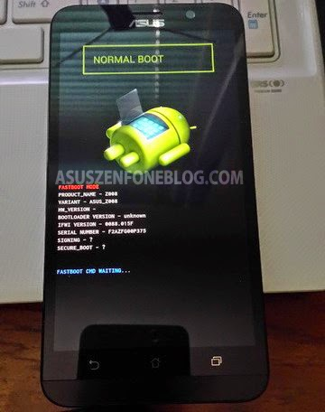
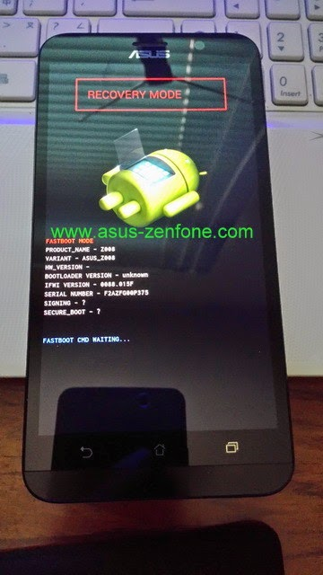
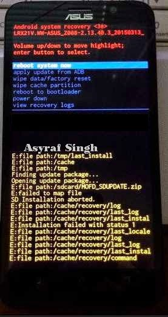

# Asus Zenfone 2 Rooting
Istruzioni minimali per il Rooting dell'Asus Zenfone 2 (ASUS_Z00AD)

### Avvertenze
####ROOT AT YOUR OWN RISK!

#####N.B: Una volta eseguito il procedimento di Rooting del dispositivo, non potrete installare aggiornamenti di sistema senza aver precedentemente eseguito l'Unroot. L'installazione di un aggiornamento di sistema risulterà nell'inutilizzabilità del vostro dispositivo con conseguente perdita dei dati.


### Prerequisiti
####Asus_Zenfone_2_Rooting_Files.zip

Scaricare ed estrarre il file "Asus_Zenfone_2_Rooting_Files.zip" che trovate tra i files di questa repo.
Dentro sono presenti sia gli strumenti (Windows e Mac OS X) che i file da utilizzare per flashare il dispositivo.

####Linux

Per Linux dovrete installare android-tools:

Arch:	https://wiki.archlinux.org/index.php/Android

Debian:	https://packages.debian.org/sid/android-tools-adb

Ubuntu:	https://launchpad.net/ubuntu/+source/android-tools

### Abilitare USB Debugging

Al percorso System Settings > About > Software information fate click 7 volte su "Build number" sino a che non apparirà il messaggio che indica l'attivazione della modalità Developer.

Dopo di che al percorso System Settings > Developer options, sezione "Debugging", trovate l'opzione per abilitare "USB debugging" per dispositivo.

### Collegamento USB

Collegare l'Asus Zenfone 2 al vostro computer e utilizzare i seguenti comandi per assicurarvi che il dispositivo sia stato riconosciuto.

1)
```bash
lsusb
```
Output:
```bash
...
Bus 002 Device 010: ID ****:**** ASUSTek Computer, Inc.
...
```
2)
```bash
adb devices
```
Output:
```bash
List of devices attached
F7A******419    device
```

### Rooting del Dispositivo

Eseguite il seguente comando e attendete che il dispositivo si riavvii:
```bash
adb reboot-bootloader
```
(adb reboot-bootloader: reboots the device into the bootloader.)

Il risultato che si ottiene è il seguente:



A questo punto eseguiti comandi uno dopo l'altro aspettando che ciascun termini prima di eseguire il successivo:

N.B: i comandi sono immessi con la cartella Asus_Zenfone_2_Rooting_Files come direttorio corrente:

```bash
sudo fastboot flash /system/bin/resize2fs magic
sudo fastboot flash /system/bin/tune2fs busybox
sudo fastboot flash /system/bin/partlink supersu.tgz
sudo fastboot oem start_partitioning
sudo fastboot flash /system/bin/logcat installer
sudo fastboot oem stop_partitioning
sudo fastboot reboot
```

Il procedimento di Rooting è terminato, il dispositivo si avvierà normalmente dopo l'ultimo comando.

Come ultima verifica dell'avvenuto Rooting del dispositivo, controllate che l'APP SuperSU sia installata e funzionante. Avviatela, sarà richiesto di eseguire l'aggiornamento.

### Reset

In caso di problemi, possiamo riportare l'Asus Zenfone alle impostazioni di fabrica.

Scaricate i file necessari che trovate nella seguente cartella:
https://mega.nz/#F!6NghzDxD!_aYe4M8VfPU92-2cqg7f7w

Estraete i contenuti di Z00A_WW_2.20.40.164.zip (dentro questa cartella dovrete anche estrarre "system.img.zip"), mentre il file UL-Z00A-WW-2.20.40.164-user.zip non dovrete extrarlo.

Spegnete completamente il dispositivo.

Entrate in modalità bootloader avviando il dispositivo con la combinazione "Pulsante Accesnione + Pulsante Volume Up". Teneteli premuti sino a che il dispositivo si riavvia in modalità bootleader. Dovete rilasciare il pulsante di accensione quando il dispositivo vibra e continuare a tenere premuto il pulsante volume up sino a quando apparità la schermata del bootloader sul dispositivo.

Una volta in modalità bootloeader, collegate il dispositivo al computer tramite il cavo USB per poter utilizzare i comandi fastboot e adb.

Utilizzante il pulsante del volume per scegliere "RECOVERY MODE" e premete il tasto di accensione per confermare.



Il dispositivo si riavvierà in modalità Recovery come nella seguente immagine:



###### N.B: potreste ottenere una schermata di errore a questo punto. Per risolvere e avviare la Recovery Mode, tenete premuto il tasto di accesione e premete il pulsante "Volume UP" una volta, apparirà la Recovery Mode.

Selezionate "wipe data/factory reset" e date conferma con il tasto di accensione.

Ugualmente cancelliamo anche la partizione di cache utilizzando la funzione "wipa cache partition".

Una volta fatto, utilizzate "reboot to bootloader" per ritornare al bootloader.

Una volta che il dispositivo si è riavviato, utilizziamo i seguenti comandi per flashare alcune partizioni con i file scaricati.

I comandi seguenti sono relativi alla cartella "Z00A_WW_2.20.40.164":

```bash
fastboot flash system system.img
fastboot flash droidboot droidboot.img
fastboot flash boot boot.img
fastboot flash recovery recovery.img
```

###### Controllate che i comandi siano andati tutti a buon fine.

Utilizzante il pulsante del volume per scegliere "RECOVERY MODE" e premete il tasto di accensione per confermare, come avete fatto precedentemente.

Una volta in modalità recovery, scegliete "apply update from ADB" e confermate con il tasto di accensione. Con il dispositivo collegato via USB, date il seguente comando:

```bash
adb sideload UL-Z00A-WW-2.20.40.164-user.zip
```

Attendete che termini con successo, e utilizzate il comando "reboot system now" dal menu recovery.

Il dispositivo si riavvierà con le caratteristiche di fabbrica.

###### L'avvio richiederà più tempo del solito. Attendete.

### Riferimenti

- http://forum.xda-developers.com/zenfone2/general/root-newbie-root-instructions-zenfone-2-t3114063
- http://www.androidiani.com/forum/asus-zenfone-2/495130-guida-su-come-riportare-zenfone-2-firmware-stock-e-cancellare-twrp.html